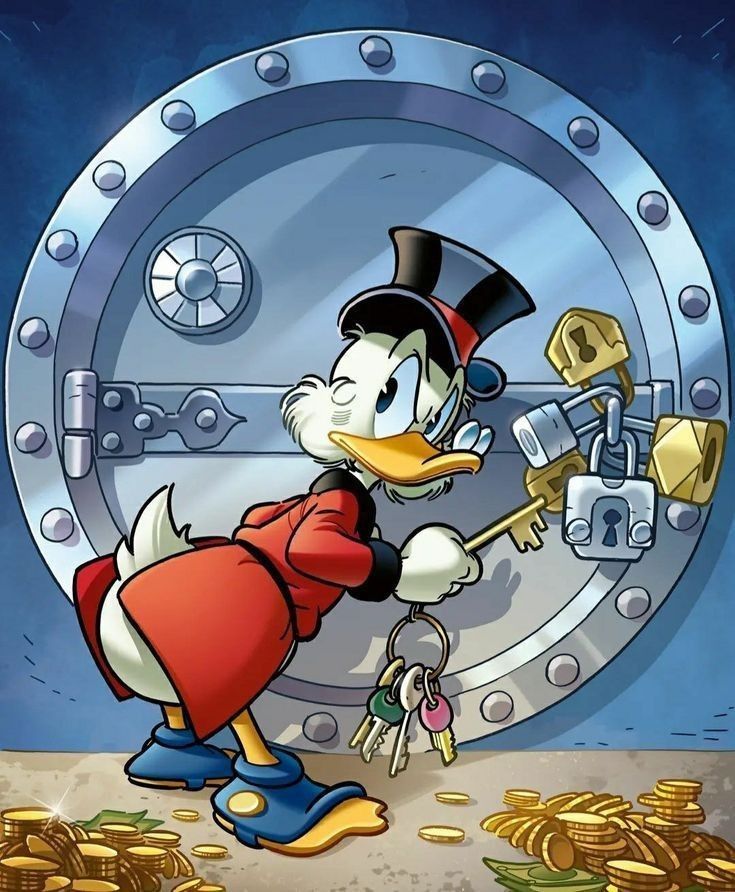

<!-- .slide: data-background-image="images/brand-art/p-liquidity.jpg" class="cover art vcenter" -->

<div class="lockup">Marinade</div>

# Inside Marinade's staking stack

## An introductory tour of staking infrastructure on <span class="accent">Solana</span>

<div class="logo-row">

</div>

<span class="note">Ondra Chaloupka</span>

Note:
**I am here to talk about staking on Solana, and to walk you through the engineering Marinade puts behind it. All you need to do is press a single button. Everything else is what I want to show you.**
THE OPENING, first twenty seconds, and it is worth having word for word because the
first sentence is the only one nobody talks over.
"I am here to talk about staking on Solana, and to walk you through the engineering
Marinade puts behind it. All you need to do is press a single button. Everything else
is what I want to show you."
Then set the shape of the talk in one breath: "Who picks the validators, what keeps
them honest, and how you get out again."
NOT "the best staking experience", and not any superlative. The brand guide bans them,
and other staking providers are in this room, so a claim of best invites an argument in
your first ten seconds. The one-button line makes the same point and cannot be
challenged.
THEN BUY PERMISSION FOR THE BASICS, one line, because the room is mixed and both
halves need to hear it: "Some of you run validators, some of you have never staked
anything. I will start from zero and then get technical fast."
Then go to the agenda. Do not open by thanking the organisers, do not apologise for
the slot length, and do not introduce yourself first: the hook comes before the name.
The programme still carries the submitted title, "The Marinade Recipe: Building Staking
Infrastructure on Solana". The deck drops it: "Recipes" is a live Marinade product and
the collision would cost the first minute. The subtitle now says "an introductory
tour", which is also the promise the opening line makes. Conference name deliberately
absent.

---

<!-- .slide: class="anchor-top" -->

## What we are going to cook through

<!-- Lucide "square-terminal" geometry, with its second-line underscore replaced by a
     filled block cursor. Inlined so currentColor picks up the theme. The frame is what
     makes it read as an object rather than two marks. -->
<svg class="slide-icon wash" viewBox="0 0 24 24" fill="none" stroke="currentColor" stroke-width="0.55" stroke-linecap="round" stroke-linejoin="round" aria-hidden="true">
<rect width="18" height="18" x="3" y="3" rx="2" ry="2"/>
<path d="m7 11 2-2-2-2"/>
<rect class="cursor" x="10.8" y="7.3" width="3.6" height="3.4" rx="0.3" fill="currentColor" stroke="none"/>
</svg>

<!-- Must be a div, not a span: markdown wraps a bare span in a <p>, and that <p>
     then becomes the containing block, breaking the absolute pinning.
     Hat only, no wordmark: the cover already showed the full lockup. -->
<div class="brand-mark"></div>

<div class="agenda">
<div>
<span class="agenda-name">What is staking</span>
<span class="agenda-shout">Why a blockchain pays you to lock money up</span>
</div>
<div>
<span class="agenda-name">Liquid staking</span>
<span class="agenda-shout">The original Solana LST</span>
</div>
<div>
<span class="agenda-name">Native staking</span>
<span class="agenda-shout">Keep custody. No program ever holds your SOL.</span>
<!-- Parked: the three strategies crowd the agenda and land better inside the Native
     section, where the room has context. Reuse this block for a strategies slide there,
     and spend the $BONK line as a surprise rather than a bullet.
<ul class="agenda-sub">
<li><strong>Max Yield</strong> 100+ validators bidding for your stake</li>
<li><strong>Select</strong> Verified identity, zero tolerance for malicious MEV</li>
<li><strong>Recipes</strong> Stake SOL, get paid in <span class="accent">$BONK</span></li>
</ul>
-->
</div>
<div>
<span class="agenda-name">Bonds and instant unstake</span>
<span class="agenda-shout">Collateral, and skipping the cooldown</span>
</div>
</div>

Note:
Three products, nothing more. The Native strategies are parked in a comment in this
file and belong in the Native section, where the room has context for them.
Do not read the shout-outs out loud, they are there to be scanned.

---

## Who talks to you

<div class="bio">

<div>
<p class="bio-name">Ondra Chaloupka <span class="bio-handle"><a href="https://x.com/_chalda">@_chalda</a></span></p>
<ul>
<li><strong>Backend developer</strong> at <a href="https://marinade.finance">Marinade</a>

</li>
<li>Before that, <a href="https://jbossts.blogspot.com/2018/01/narayana-periodic-recovery-of-xa.html">Java engineer</a> at Red Hat
</li>
<li>Came for distributed systems, <a href="https://blog.chalda.cz/">stayed for Solana</a></li>
<li>Contributor to Realms, and author of its <a href="https://www.youtube.com/watch?v=2lzzbyWYIpc">SPL Governance deep dive</a>
</li>
</ul>
</div>
</div>

Note:
The distributed systems line is deliberately past tense. It is the honest version,
it explains how I got here rather than claiming an active practice.

---

<!-- .slide: class="with-art anchor-top" -->

## Who is Marinade

<div class="side-art hat"></div>

<div class="agenda">
<div>
<span class="agenda-name">Born in a hackathon, 2021</span>
<span class="agenda-shout">Two projects merged, and shipped the first liquid staking token on Solana.</span>
</div>
<div>
<span class="agenda-name">A DAO with a public forum</span>
<span class="agenda-shout">MNDE holders lock their tokens to vote, and proposals are argued in the open.</span>
</div>
<div>
<span class="agenda-name">A stake automation platform</span>
<span class="agenda-shout">Marinade's own words. Chasing rewards and Solana's decentralisation at once.</span>
</div>
</div>

<p class="slide-foot">Five years on one chain, bootstrapped by grants rather than venture capital.</p>

Note:
Short. This is credibility, not a pitch, so do not sell.
THE HISTORY: spring 2021, out of two hackathon projects that merged. First liquid
staking token on Solana. That is the sentence that buys the rest of the talk: we have
been running this through five years of Solana changing underneath us.
THE DAO: MNDE launched October 2021 and on-chain governance followed in 2022. Token
holders lock MNDE to vote, and the forum is public. Say "a DAO and a team", not "a
company", because both are true and the DAO is the part people do not expect.
THE POSITIONING, in Marinade's own words from docs.marinade.finance: "a stake
automation platform that helps you maximize SOL staking rewards while supporting the
decentralization and performance of the Solana network." Do NOT call it a staking
protocol, that is off-brand.
[VERIFY BEFORE THE TALK] the foot line says grants rather than venture capital. That
comes from Marinade's own education article, written 2022 and updated 2024. Confirm it
still holds, or drop the line: it is the one claim on this slide that could have aged.
LIKE THIS, if the room is not crypto native: a DAO is a co-operative. The members
hold the token, the token votes, and the arguments happen in public rather than in a
board room.
Leaves the question: fine, but before any of the products, what is staking even doing?

---

<!-- .slide: -->

## What is staking

<!-- Lucide "hand-coins", ISC. Thin stroke because the icon set is drawn for 24px:
     at this size the stock stroke-width of 2 reads as heavy bars. -->
<svg class="slide-icon wash" viewBox="0 0 24 24" fill="none" stroke="currentColor" stroke-width="0.6" stroke-linecap="round" stroke-linejoin="round" aria-hidden="true">
<path d="M11 15h2a2 2 0 1 0 0-4h-3c-.6 0-1.1.2-1.4.6L3 17"/>
<path d="m7 21 1.6-1.4c.3-.4.8-.6 1.4-.6h4c1.1 0 2.1-.4 2.8-1.2l4.6-4.4a2 2 0 0 0-2.75-2.91l-4.2 3.9"/>
<path d="m2 16 6 6"/>
<circle cx="16" cy="9" r="2.9"/>
<circle cx="6" cy="5" r="3"/>
</svg>

<div class="grid-3">
<div class="card">
<h3>Backing the network</h3>
<p>Locked SOL says its security and uptime matter, and the network pays for that.</p>
</div>
<div class="card">
<h3>Validators do the work</h3>
<p>They run the hardware and vote on blocks, carrying the stake delegated to them.</p>
</div>
<div class="card">
<h3>Two kinds of reward</h3>
<p>Voting earns inflation. Building blocks earns fees.</p>
</div>
</div>

<p class="slide-foot">Solana's own wording: delegating your tokens does not give the validator ownership or control over them.</p>

Note:
KEEP IT SIMPLE, this is the one slide for the half of the room that does not run a
node. Three sentences, then the diagram.
WHY LOCK ANYTHING AT ALL: proof of stake needs money as the signal. Stake says the
network's security and its uptime matter to whoever locked it, and the protocol pays
for that signal. That is the whole bargain.
DELIBERATELY NOT "skin in the game", and this is worth knowing rather than glossing
over: on Solana there is no protocol slashing today, so a badly chosen validator costs
rewards, not principal. Nothing gets burned. Solana's terminology page does define
stake as forfeitable if malicious behaviour can be proven, so the intent is there, but
do not tell a room of engineers that the chain destroys stake today.
VALIDATORS, not "somebody": they run the hardware, they vote on every block, and the
stake delegated to them is what gives their vote weight.
TWO KINDS OF REWARD, and the next slide draws both. Voting earns inflation, paid per
epoch against vote credits. Building blocks earns the fees inside them. Keep them
separate in the room's head, because who ends up with each one is the whole reason the
auction exists later.
LIKE THIS, and it is the analogy to use if the room looks lost: staking is lending
your weight to a night shift. Somebody else runs the machines, your money is what
says their signature counts, and the network pays for the shift being covered.
WHERE IT BREAKS, say it if you use the word deposit: on Solana nothing seizes that
money. A bad choice costs you the rewards, not the principal.
Leaves the question: so how does the chain decide who builds a block?

---

<!-- .slide: -->

## Stake decides who builds

<div class="figure-wide"><svg class="pos" viewBox="0 0 1680 520" role="img"><title>Stakers delegate to validators. Every validator votes on every block and earns inflation, which flows back to the stakers. Stake also decides how many slots a validator gets, and the fees in those blocks stay with the validator.</title><text class="pos-head" x="95" y="44">Stakers</text><text class="pos-head" x="441" y="44">Validators</text><rect class="pos-box" x="20" y="100" width="150" height="44" rx="10"/><text class="pos-lbl" x="95" y="129">SOL</text><rect class="pos-box" x="20" y="166" width="150" height="44" rx="10"/><text class="pos-lbl" x="95" y="195">SOL</text><rect class="pos-box" x="20" y="232" width="150" height="44" rx="10"/><text class="pos-lbl" x="95" y="261">SOL</text><rect class="pos-box" x="20" y="298" width="150" height="44" rx="10"/><text class="pos-lbl" x="95" y="327">SOL</text><path class="pos-arrow" d="M186 222 H286"/><path class="pos-arrow" d="M278 214 l10 8 -10 8"/><text class="pos-note" x="236" y="204">delegate</text><rect class="pos-box" x="316" y="76" width="250" height="80" rx="12"/><text class="pos-lbl" x="352" y="124">A</text><rect class="pos-pip" x="388" y="106" width="26" height="22" rx="5"/><rect class="pos-pip" x="422" y="106" width="26" height="22" rx="5"/><rect class="pos-pip" x="456" y="106" width="26" height="22" rx="5"/><rect class="pos-pip" x="490" y="106" width="26" height="22" rx="5"/><rect class="pos-pip" x="524" y="106" width="26" height="22" rx="5"/><rect class="pos-box" x="316" y="186" width="250" height="80" rx="12"/><text class="pos-lbl" x="352" y="234">B</text><rect class="pos-pip" x="388" y="216" width="26" height="22" rx="5"/><rect class="pos-pip" x="422" y="216" width="26" height="22" rx="5"/><rect class="pos-pip" x="456" y="216" width="26" height="22" rx="5"/><rect class="pos-box" x="316" y="296" width="250" height="80" rx="12"/><text class="pos-lbl" x="352" y="344">C</text><rect class="pos-pip" x="388" y="326" width="26" height="22" rx="5"/><path class="pos-arrow" d="M586 116 H1300"/><path class="pos-arrow" d="M1292 108 l10 8 -10 8"/><text class="pos-note" x="940" y="96">all of them vote on every block</text><rect class="pos-out" x="1330" y="76" width="230" height="86" rx="12"/><text class="pos-out-lbl" x="1445" y="114">Inflation</text><text class="pos-out-sub" x="1445" y="144">paid every epoch</text><path class="pos-arrow" d="M586 336 H716"/><path class="pos-arrow" d="M708 328 l10 8 -10 8"/><text class="pos-note" x="1000" y="284">stake decides how many slots each one gets</text><rect class="pos-slot a" x="740" y="304" width="52" height="64" rx="9"/><text class="pos-slot-lbl" x="766" y="345">A</text><rect class="pos-slot a" x="798" y="304" width="52" height="64" rx="9"/><text class="pos-slot-lbl" x="824" y="345">A</text><rect class="pos-slot a" x="856" y="304" width="52" height="64" rx="9"/><text class="pos-slot-lbl" x="882" y="345">A</text><rect class="pos-slot a" x="914" y="304" width="52" height="64" rx="9"/><text class="pos-slot-lbl" x="940" y="345">A</text><rect class="pos-slot a" x="972" y="304" width="52" height="64" rx="9"/><text class="pos-slot-lbl" x="998" y="345">A</text><rect class="pos-slot b" x="1030" y="304" width="52" height="64" rx="9"/><text class="pos-slot-lbl" x="1056" y="345">B</text><rect class="pos-slot b" x="1088" y="304" width="52" height="64" rx="9"/><text class="pos-slot-lbl" x="1114" y="345">B</text><rect class="pos-slot b" x="1146" y="304" width="52" height="64" rx="9"/><text class="pos-slot-lbl" x="1172" y="345">B</text><rect class="pos-slot c" x="1204" y="304" width="52" height="64" rx="9"/><text class="pos-slot-lbl" x="1230" y="345">C</text><path class="pos-arrow" d="M1268 336 H1300"/><path class="pos-arrow" d="M1292 328 l10 8 -10 8"/><rect class="pos-out" x="1330" y="294" width="230" height="86" rx="12"/><text class="pos-out-lbl" x="1445" y="332">Fees</text><text class="pos-out-sub" x="1445" y="362">in the blocks they build</text><text class="pos-note" x="1445" y="410">stays with the validator</text><path class="pos-arrow dashed" d="M1560 119 H1632 V470 H95 V346"/><path class="pos-arrow" d="M87 354 l8 -10 8 10"/><text class="pos-note" x="800" y="500">inflation lands with the stakers, every epoch</text></svg></div>

<p class="slide-foot">Base fee is 5,000 lamports per signature, half burned and half to the validator. Priority fees go to the validator in full.</p>

Note:
TWO LANES, and the split is the point of the slide. Walk the left side first, then
take the top lane, then the bottom one.
LEFT: stakers delegate, and each validator ends up carrying a different amount of
stake, drawn as the little blocks inside it.
TOP LANE, VOTING: every validator votes on every block, all the time, and that is not
a turn-taking thing. The protocol tallies vote credits and pays inflation each epoch,
the validator keeps a commission, and the rest lands with the stakers. That is the
dashed arrow, and it is the part of the picture that is the audience's money.
BOTTOM LANE, BUILDING: this is where stake decides something. Solana builds a leader
schedule for the epoch and the number of slots a validator gets follows its stake. A
slot is its turn to produce a block, so more stake means more turns.
THE FEES FROM THOSE BLOCKS STAY WITH THE VALIDATOR. Say it plainly and let it sit
there unresolved: base fee is 5,000 lamports a signature with half burned and half to
the validator, priority fees all of it, and MEV on top, outside the protocol.
[THE SEED FOR THE WHOLE TALK, do not resolve it here] there is no in-protocol way for
a validator to hand a share of that back to the people whose stake earned it. Two
sections from now, the auction and the bonds are exactly that missing path.
LIKE THIS: the leader schedule is a rota. It is drawn up for the whole epoch in
advance, and the more stake a validator carries the more shifts it gets on the rota.
Voting is different: everybody signs off on everybody else's shift, all the time.
Leaves the question: fine, so what does Marinade actually build on top of that?

---

<!-- .slide: data-background-image="images/brand-art/p-rewards.jpg" class="art" data-stage="stake" -->

<div class="label">Liquid staking</div>

## You all know what liquid staking is

<div class="grid-3">
<div class="card">
<h3>You hand over SOL</h3>
<p>The protocol takes it. Only you can ask for your share back.</p>
</div>
<div class="card">
<h3><svg class="inline-icon" viewBox="0 0 24 24" aria-hidden="true"><rect width="18" height="11" x="3" y="11" rx="2"/><path d="M7 11V7a5 5 0 0 1 10 0v4"/></svg>An on-chain program holds it</h3>
<p>Marinade delegates it, and keeps delegating it well.</p>
</div>
<div class="card">
<h3>You hold <span class="token">mSOL</span></h3>
<p>Liquidity you can use across DeFi.</p>
</div>
</div>

<p class="slide-foot">First liquid staking protocol on Solana. 2021, out of two hackathon teams.</p>

Note:
THIS SLIDE OPENS THE SECTION. There is no separate Liquid staking break any more:
the label carries the product name and the painting carries the mood. Answer the
question the bio slide left open in the first sentence, out loud: what does this
stack actually do, and we start with the product that came first.
Fast, everybody knows this. What to say over the top: the protocol takes ownership
of your SOL as a whole, and it is wired in that only you can ask your portion back.
Meanwhile we manage that stake to collect staking rewards and other on-chain
rewards, so the SOL you put in is worth more. And you are holding mSOL the whole
time, free to use it in DeFi.
The words that matter later are ON-CHAIN PROGRAM. Say them deliberately.
LIKE THIS, for anyone who has never held an LST: mSOL is the cloakroom ticket. The
coat stays in the cloakroom, but you can sell the ticket to somebody else and they
collect the coat.
WHERE IT BREAKS: a cloakroom ticket does not get more valuable while you hold it.
This one does, which is the whole point.
Leaves the question: fine, but somebody has to decide where all that stake goes.

---

<!-- .slide: class="center-text" -->
<!-- No data-stage on purpose: the journey rail would clutter the joke. -->

## You staked.


<p class="punch">Now what?</p>

Note:
The playful beat. You handed over your SOL, the token is in your wallet, and the
money is supposed to start rolling in. Land the joke, let it breathe, then turn.
The answer is not magic, it is machinery, and that is the next slide.
Leaves the question: so what is actually happening while I do nothing?

---

<!-- .slide: data-stage="stake" -->

<div class="gears" aria-hidden="true">
<svg class="gear gear-a" style="width:430px;height:430px;top:40px;left:100px" viewBox="0 0 24 24"><path d="M11 10.27 7 3.34"/><path d="m11 13.73-4 6.93"/><path d="M12 22v-2"/><path d="M12 2v2"/><path d="M14 12h8"/><path d="m17 20.66-1-1.73"/><path d="m17 3.34-1 1.73"/><path d="M2 12h2"/><path d="m20.66 17-1.73-1"/><path d="m20.66 7-1.73 1"/><path d="m3.34 17 1.73-1"/><path d="m3.34 7 1.73 1"/><circle cx="12" cy="12" r="2"/><circle cx="12" cy="12" r="8"/></svg>
<svg class="gear gear-b" style="width:310px;height:310px;top:400px;left:420px" viewBox="0 0 24 24"><path d="M11 10.27 7 3.34"/><path d="m11 13.73-4 6.93"/><path d="M12 22v-2"/><path d="M12 2v2"/><path d="M14 12h8"/><path d="m17 20.66-1-1.73"/><path d="m17 3.34-1 1.73"/><path d="M2 12h2"/><path d="m20.66 17-1.73-1"/><path d="m20.66 7-1.73 1"/><path d="m3.34 17 1.73-1"/><path d="m3.34 7 1.73 1"/><circle cx="12" cy="12" r="2"/><circle cx="12" cy="12" r="8"/></svg>
<svg class="gear gear-c" style="width:230px;height:230px;top:120px;left:480px" viewBox="0 0 24 24"><path d="M11 10.27 7 3.34"/><path d="m11 13.73-4 6.93"/><path d="M12 22v-2"/><path d="M12 2v2"/><path d="M14 12h8"/><path d="m17 20.66-1-1.73"/><path d="m17 3.34-1 1.73"/><path d="M2 12h2"/><path d="m20.66 17-1.73-1"/><path d="m20.66 7-1.73 1"/><path d="m3.34 17 1.73-1"/><path d="m3.34 7 1.73 1"/><circle cx="12" cy="12" r="2"/><circle cx="12" cy="12" r="8"/></svg>
</div>

## Somebody has to choose the validators

<div class="grid-3">
<div class="card">
<h3>Watch</h3>
<p>Every validator on Solana, every epoch.</p>
</div>
<div class="card">
<h3>Judge</h3>
<p>Who pays best, who stays up, who keeps the network spread out.</p>
</div>
<div class="card">
<h3>Move</h3>
<p>Stake follows the answer.</p>
</div>
</div>

<p class="slide-foot">A validator worth staking last epoch may not be worth it in this one.</p>

Note:
THE MESSAGE: Marinade runs machinery that collects data off Solana, works out where
the best yield and the better decentralisation actually are, and moves stake there.
Not "a choice exists", but "we built the thing that makes the choice, continuously".
What we collect: uptime, vote credits, commission, MEV, where they run.
The validator manager is the authority that writes the answer on chain. One key,
ValidatorSystem.manager_authority. It adds and removes validators, sets scores, and
holds the emergency levers. The code sometimes names the parameter
validator_manager_authority, but it is the same key.
[TODO] Ondra wants a picture that says "this is not easy". The pantry painting is a
placeholder for that, a lone cook managing an enormous store. Replace if a better
meme turns up.
NEVER name a competitor on a slide. The difference is worth two sentences ON STAGE
only: most pools have a single staker key that names the validator set and can move
any amount of stake at any time. We put scoring and a per-epoch movement cap in the
program instead.
Do NOT mention the auction yet. That is the next slide.
LIKE THIS: it is a fund manager rebalancing, not a one-off decision. Somebody reads
the numbers every period and moves the money toward whatever is performing, and the
reading never stops.
Leaves the question: so who actually turns all this, and how often?

---

<!-- .slide: data-stage="stake" -->

## A stake account cannot move sideways

<div class="cycle">
<svg viewBox="0 0 1000 460" aria-hidden="true">
<defs><marker id="ah" viewBox="0 0 10 10" refX="9" refY="5" markerWidth="7" markerHeight="7" orient="auto-start-reverse"><path d="M0 0 L10 5 L0 10 z" fill="#308D8A"/></marker></defs>
<g fill="none" stroke="#308D8A" stroke-width="2" marker-end="url(#ah)">
<path d="M623.1 51.4 A360 190 0 0 1 838.4 165.0"/>
<path d="M838.4 295.0 A360 190 0 0 1 623.1 408.6"/>
<path d="M376.9 408.6 A360 190 0 0 1 161.6 295.0"/>
<path d="M161.6 165.0 A360 190 0 0 1 376.9 51.4"/>
</g>
</svg>
<div class="cycle-node" style="left:500px;top:40px"><h3>Active</h3><span>earning</span></div>
<div class="cycle-node" style="left:860px;top:230px"><h3>Deactivating</h3><span>still earning</span></div>
<div class="cycle-node cost" style="left:500px;top:420px"><h3>Inactive</h3><span>earning nothing</span></div>
<div class="cycle-node cost" style="left:140px;top:230px"><h3>Activating</h3><span>earning nothing</span></div>
<span class="cycle-edge" style="left:790px;top:78px">deactivate</span>
<span class="cycle-edge wait" style="left:790px;top:390px">epoch</span>
<span class="cycle-edge" style="left:215px;top:390px">delegate</span>
<span class="cycle-edge wait" style="left:215px;top:78px">epoch</span>
</div>

<p class="slide-foot">There is no arrow across the middle. Solana never enabled redelegation.</p>

Note:
Names are Solana's own: Active, Deactivating, Inactive, Activating.
THE CORRECTION WORTH KNOWING: Deactivating still earns. The stake stays effective
for that epoch. Inactive and Activating are the ones that pay nothing, and from a
rewards point of view they are the same thing. That is the yellow half of the ring.
Also: Inactive to Activating can happen in the SAME epoch. You do not wait an extra
epoch to re-delegate. So the cost is not four epochs, it is the yellow arc.
THIS IS THE SLIDE FOR THE HARD PART. A validator goes down, or quietly raises its
commission against our stakers. The obvious move is to pull the stake now. There is
no sideways. The account has to go all the way round, and half that circle pays the
staker nothing.
So every rebalance is a trade: yield lost going round, against yield lost by staying
put. React to every wobble and you cost the stakers more than the wobbles do. That
is why the auction emits priorities rather than a bare target, and why the program
caps how much can move per epoch.
LIKE THIS, and this one always lands: it is switching energy supplier. You cannot
jump straight from one to the other. You give notice, you sit out the notice period,
and only then do you start with the new one. The notice period is the cost.
Leaves the question: fine, so who is even worth moving to?

---

<!-- .slide: data-stage="bond" class="center-text" -->


<p class="punch">Bonds. Validators back their word with their own SOL.</p>

Note:
One line under the picture, and it is deliberately on the validator's side. An
earlier version read "their bad days come out of the deposit", which framed
validators as the problem. They are not. They are partners who choose to put
collateral up so that we can promise stakers a floor without asking anyone to
trust us.
SAY OUT LOUD, do not slide it: this is also the setup for the auction. Solana has
no way for a validator to pay a staker a share of its priority fees, so how do we
get you more than the protocol pays?
Say "slash" ONCE here, then correct it immediately: on Solana slashing means the
protocol destroys staked principal. We cannot do that and do not. We take from a
bond the validator posted, to cover rewards you did not get. Principal is never
touched. Then drop back to "the bond covers the loss".
We have to be good to validators too. The bond is not a punishment beating, it is
the thing that lets us promise stakers a floor without asking anyone to trust us.
The foot line is the setup. SIMD-0096 sent 100% of priority fees to validators.
SIMD-0123 will let them share block rewards in protocol, passed governance March
2025, not live yet. Until then there is no native path, so we built one.
Leaves the question: so how DO you get me more?

---

<!-- .slide: data-stage="auction" -->

## Validators bid for your stake

<div class="ladder" aria-hidden="true">
<svg viewBox="0 0 400 300">
<rect x="8" y="30" width="22" height="250"/><rect x="40" y="48" width="22" height="232"/><rect x="72" y="66" width="22" height="214"/><rect x="104" y="82" width="22" height="198"/><rect x="136" y="100" width="22" height="180"/><rect x="168" y="118" width="22" height="162"/><rect x="200" y="134" width="22" height="146"/><rect x="232" y="152" width="22" height="128"/><rect x="264" y="170" width="22" height="110"/><rect x="296" y="186" width="22" height="94"/><rect x="328" y="204" width="22" height="76"/><rect x="360" y="220" width="22" height="60"/>
<line x1="0" y1="152" x2="400" y2="152"/>
</svg>
</div>

<div class="steps">
<div><div class="step-num">1</div><h3>Bid</h3>A validator offers a share of its rewards.</div>
<div><div class="step-num">2</div><h3>Allocate</h3>Highest first, until the stake runs out.</div>
<div><div class="step-num">3</div><h3>Clear</h3>The last winner in sets the price.</div>
</div>

<p class="slide-foot">Everyone who wins is paid that same clearing rate, not their own bid. Inflation and MEV come from Solana. This is the third thing you earn.</p>

Note:
Deliberately NOT a mechanism deep-dive. The previous deck did last-price for a
SAM-literate room; this one is not that room.
The fairness point is the one sentence worth making: bidding aggressively does not
punish you, because you are paid the clearing price, not your own number. That keeps
the auction honest and stops a race to the bottom.
The yield decomposition is real, it is the RevShare struct:
totalPmpe = inflationPmpe + mevPmpe + bidPmpe. Say it, do not slide it.
LIKE THIS: a shop giving you a discount to win your custom. The validator earns more
with more stake, so it hands back part of that to attract yours. The discount is your
extra yield.
Leaves the question: a bid is a promise. How does a promise become money in my
wallet?

---

<!-- .slide: data-stage="settle" -->

## From promise to payment

<div class="split-media">
<!-- Callback to the "You staked. Now what?" slide. Same duck, now doing the paperwork. -->

<ol class="beats">
<li><strong>Measure</strong> End of epoch, read what happened.</li>
<li><strong>Calculate</strong> What each validator owes.</li>
<li><strong>Settle</strong> Written on chain, out of the bonds.</li>
<li><strong>Claim</strong> Bids and covered losses reach the stakers.</li>
</ol>
</div>

<p class="slide-foot">Until SIMD-0123 is live, Solana has no native way to pass priority fees to stakers.</p>

Note:
Deliberately light. No six-stage pipeline diagram, no merkle-tree detail unless
somebody asks. The point is the shape, and WHAT MOVES: the auction bids a validator
promised, and the rewards PSR covers when it underperformed. Both come out of the
same bond and end up with the staker.
Claiming is permissionless, but that is a footnote, not the headline. Say it only
if somebody asks who runs the payout.
If asked how: snapshot the chain state, a distribution CLI computes the settlement,
merkle trees go on chain, claims are made against them.
LIKE THIS: a dividend list. The company works out who is owed what, publishes the
list, and anybody on it can walk up and collect. Nobody has to be asked twice, and
the list is public.
Leaves the question, and it opens the next section: all of this is an ON-CHAIN
PROGRAM holding your SOL. What if you do not want a program at all?

---

<!-- .slide: data-background-image="images/brand-art/p-security.jpg" class="art" data-rail="native" data-stage="stake" -->

## Not everyone wants a program holding their SOL

<div class="stamp"><svg viewBox="-8 -8 616 236" role="img"><title>Native staking</title><polygon points="300,-0 351,41 442,21 451,55 546,59 492,91 606,110 492,129 546,161 451,165 442,199 351,179 300,220 249,179 158,199 149,165 54,161 108,129 -6,110 108,91 54,59 149,55 158,21 249,41"/><text x="300" y="134" text-anchor="middle">Native staking</text></svg></div>

<div class="grid-3">
<div class="card">
<h3>No contract risk</h3>
<p>The SOL never leaves your possession.</p>
</div>
<div class="card">
<h3>No token</h3>
<p>Nothing to hold or explain to an auditor.</p>
</div>
<div class="card">
<h3>Just the delegation</h3>
<p>Marinade picks the validators, nothing more.</p>
</div>
</div>

<p class="slide-foot">Launched July 2023. Rewards land straight in your account each epoch, so it compounds without anyone doing anything.</p>

Note:
THIS SLIDE OPENS THE SECTION. There is no separate Native staking break any more:
the stamp carries the section name, the painting carries the mood, and the rail
switches to the native one here. Answer the question Liquid left open in the first
sentence, out loud: all of that was an ON-CHAIN PROGRAM holding your SOL, so what if
you do not want a program at all?
The why, and it is a real one. Some people are simply not comfortable with a
program custodying funds, and plenty of stakers do not want a liquid token at all.
They want the delegation managed and nothing more.
Institutions have the same requirement for a different reason: no token means
nothing to account for, and no program means a much shorter audit conversation.
Worth saying: you can always reclaim the stake authority and withdraw with the
Solana CLI, without us. That is documented publicly in the how-to-native-staking
repository.
LIKE THIS, and it is the cleanest analogy in the talk: a power of attorney. You keep
the account in your own name, and you sign a limited mandate letting somebody move
money between products for you. They cannot take it out.
Leaves the question: so how do you manage my stake without ever holding it?

---

<!-- .slide: data-rail="native" data-stage="stake" class="code-sm" -->

## Solana splits the keys

```rust
pub enum StakeStateV2 {
    Uninitialized, Initialized(Meta), Stake(Meta, Stake, StakeFlags), RewardsPool,
}
```

```text
Meta            rent_exempt_reserve, authorized, lockup
  Authorized    staker, withdrawer
  Lockup        unix_timestamp, epoch, custodian
Stake           delegation, credits_observed
  Delegation    voter_pubkey, stake, activation_epoch, deactivation_epoch
```

```rust
pub struct Authorized {
    pub staker: Pubkey,     // may delegate
    pub withdrawer: Pubkey, // may take the money
}
```

<div class="side-art"></div>

<p class="slide-foot">One account. Custody is in Meta, the delegation is in Stake, and Marinade only ever holds one field of the first.</p>

Note:
Walk the three boxes in order, they are one object seen three ways.
TOP: the account is an enum, and the variant IS the state. Uninitialized, holding
only Meta, or fully delegated as Stake(Meta, Stake, StakeFlags).
MIDDLE: what hangs off that. Meta is custody, and it carries the keys and the
lockup. Stake is the delegation, and it carries the validator and the two epoch
numbers. Every field of a stake account is on this slide.
BOTTOM: the two fields the whole product rests on. The comments are mine, the
fields are Solana's.
THE POINT IS STILL CUSTODY. The staker authority can delegate, split, merge and
deactivate. It cannot move a single lamport out. The withdrawer can, and the user
keeps the withdrawer, always. So "no smart contract risk" is mechanical here, not
marketing: no program holds the balance, only an authority points at it.
CALLBACK, and it is the reason the middle box is worth the room: activation_epoch
and deactivation_epoch are the ring from the Liquid section. The state is not a
status field anybody maintains, it is two numbers compared against the current
epoch.
THE TERM, SPOKEN ONLY, deliberately not on the slide. People call this delegated
proof-of-stake, and you can say it, but know
the exposure before you do: solana.com/staking never uses that phrase. It says Proof
of Stake, and describes delegation separately as assigning tokens to a validator to
increase its voting weight. DPoS usually means an elected delegate set, EOS and Tron
style, which Solana does not have. "Proof of stake, with delegation" is the safe
phrasing, and the label on the slide says exactly that.
THE GIFT FROM THAT PAGE, quote it if the room needs convincing, it is Solana's own
sentence and not ours: "Delegating your tokens to a validator does NOT give the
validator ownership or control over your tokens." That is this slide in one line,
written by the people who built the chain.
LIKE THIS: two signatures on a bank mandate. One lets somebody manage the money,
the other lets somebody take it out. Solana keeps them separate at the account level,
and Marinade is only ever on the first one.
WHERE IT BREAKS: with a bank you would have lawyers. Here the limit is mechanical,
which is stronger and also colder.
Leaves the question: so who, or what, is actually holding that staker key?

---

<!-- .slide: data-rail="native" data-stage="stake" -->

<!-- No heading: the line under the picture says it, and a heading saying the same
     thing twice was the reason this slide read as annoying. -->



<p class="punch">Nobody at Marinade holds a keyring like this.</p>

<p class="slide-foot">The staking authority is a program address.</p>

Note:
THE PICTURE IS THE THING WE DID NOT BUILD, so say that first or the joke inverts:
that is a hot wallet, a keyring somebody has to carry, and every key on it is
something that can leak.
THE ARGUMENT, and it is the good one, not the obvious one. The obvious defence is
that a staking authority cannot steal anything, so a hot key would be survivable.
The real problem is recovery: only the OWNER can assign or revoke the staking
authority, so if our key leaked we could not rotate it. Every user would have to act
individually, on every stake account they hold. That is unfixable from our side, so
the key must not exist at all.
HENCE A PDA: a program address with no private key. Nothing to lose, nothing to leak,
and the DAO can change who operates the program without touching one stake account.
Source: native-staking/programs/marinade-native-proxy/README.md.
LIKE THIS, for a room that does not think in keys: there is nothing to steal because
the authority is a rule rather than an object. A door that opens only when the
building says so, not when somebody produces the right piece of metal.
Leaves the question: the key is safe, then. So what does Marinade actually do with
that authority?

---

<!-- .slide: data-rail="native" data-stage="stake" -->

## Three ways to run it

<div class="grid-3">
<div class="card">
<svg class="card-dial d-max" viewBox="0 0 100 60" aria-hidden="true"><path class="dial-arc" d="M10 52 A40 40 0 0 1 90 52"/><path class="dial-needle" d="M50 52 L80 42"/><circle class="dial-hub" cx="50" cy="52" r="5"/></svg>
<h3>Max Yield</h3>
<p>The default. Your stake follows the winners of the auction.</p>
</div>
<div class="card">
<svg class="card-dial d-mid" viewBox="0 0 100 60" aria-hidden="true"><path class="dial-arc" d="M10 52 A40 40 0 0 1 90 52"/><path class="dial-needle" d="M50 52 L50 20"/><circle class="dial-hub" cx="50" cy="52" r="5"/></svg>
<h3>Select</h3>
<p>A curated, identity-verified set. Built for institutions.</p>
</div>
<div class="card">
<svg class="card-dial d-low" viewBox="0 0 100 60" aria-hidden="true"><path class="dial-arc" d="M10 52 A40 40 0 0 1 90 52"/><path class="dial-needle" d="M50 52 L20 42"/><circle class="dial-hub" cx="50" cy="52" r="5"/></svg>
<h3>Recipes</h3>
<p>Your rewards are swapped, epoch by epoch, into a token you pick.</p>
</div>
</div>

<p class="slide-foot">Recipes pays out in <span class="token">$USDG</span> <span class="token">$ZBTC</span> <span class="token">$MNDE</span> <span class="token">$BONK</span> <span class="token">$FWOG</span> <span class="token">$NOBODY</span> <span class="token">$TRENCHER</span> <span class="token">$USDC</span></p>

Note:
What we do with the staker authority. Same custody model in all three, only the
policy changes.
MAX YIELD is the retail default: auto-delegation to the validators that won the
auction, so it inherits everything from the Liquid section.
SELECT is the institutional one: a curated set, identity-verified operators. This is
the ETF and treasury conversation.
RECIPES is the one to have fun with, and the honest way to introduce it is DCA.
THE SENTENCE THAT EXPLAINS IT: your principal stays in SOL, and only the yield is
converted, epoch after epoch, into a token you chose. So it is dollar cost averaging
paid for by staking rewards rather than by your wallet. Marinade's own page calls it
"DCA into token: automatically convert your staking rewards into the token you want,
bit by bit."
THREE FLAVOURS, all off the public page. Stablecoins for people who want yield without
market swings, USDG being the one that is live. Utility tokens, MNDE and zBTC. And
memecoins, which is where $FWOG and $NOBODY come in. Read that list off the slide and
let it land: they are real payout rails on a real product page, and the room will not
expect it after the institutional Select card.
SAY THE CAVEAT, it costs one sentence and buys trust: you are taking price risk on
the payout token, not on your stake. The SOL principal is untouched.
DESCRIBE RECIPES BY ITS PAYOUT RAIL ONLY. Never by where the stake is delegated.
LIKE THIS: choosing a savings account. Best rate, screened providers only, or paid
out in a different currency. Same money, same custody, three policies.
Leaves the question: three policies, one custody model. So what happens the day I
want out?

---

<!-- .slide: data-rail="native" data-stage="exit" -->

## Getting out is the hard part

<div class="funnel-wrap"><svg class="funnel" viewBox="0 0 900 268" role="img"><title>Many stake accounts are picked, deactivated in batches, then merged into one</title><rect class="acct drain" style="animation-delay:0.00s" x="20" y="58" width="40" height="40" rx="8"/><rect class="acct drain" style="animation-delay:0.34s" x="72" y="58" width="40" height="40" rx="8"/><rect class="acct drain" style="animation-delay:0.68s" x="124" y="58" width="40" height="40" rx="8"/><rect class="acct drain" style="animation-delay:1.02s" x="176" y="58" width="40" height="40" rx="8"/><rect class="acct drain" style="animation-delay:1.36s" x="20" y="110" width="40" height="40" rx="8"/><rect class="acct drain" style="animation-delay:1.70s" x="72" y="110" width="40" height="40" rx="8"/><rect class="acct drain" style="animation-delay:2.04s" x="124" y="110" width="40" height="40" rx="8"/><rect class="acct drain" style="animation-delay:2.38s" x="176" y="110" width="40" height="40" rx="8"/><rect class="acct drain" style="animation-delay:2.72s" x="20" y="162" width="40" height="40" rx="8"/><rect class="acct drain" style="animation-delay:3.06s" x="72" y="162" width="40" height="40" rx="8"/><rect class="acct drain" style="animation-delay:3.40s" x="124" y="162" width="40" height="40" rx="8"/><rect class="acct drain" style="animation-delay:3.74s" x="176" y="162" width="40" height="40" rx="8"/><rect class="acct batch" style="animation-delay:0.0s" x="366" y="66" width="86" height="40" rx="8"/><rect class="acct batch" style="animation-delay:0.8s" x="366" y="118" width="86" height="40" rx="8"/><rect class="acct batch" style="animation-delay:1.6s" x="366" y="170" width="86" height="40" rx="8"/><rect class="acct final" x="560" y="66" width="150" height="144" rx="12"/><path class="arrow" d="M240 138 H326"/><path class="arrow head" d="M318 130 l10 8 -10 8"/><path class="flow" d="M240 138 H316"/><path class="arrow" d="M474 138 H546"/><path class="arrow head" d="M538 130 l10 8 -10 8"/><path class="flow" d="M474 138 H536"/><text class="fn-step" x="283" y="120" text-anchor="middle">pick, move</text><text class="fn-step" x="510" y="120" text-anchor="middle">merge</text><text class="fn-cap" x="124" y="248" text-anchor="middle">Spread over many validators</text><text class="fn-cap" x="409" y="248" text-anchor="middle">Deactivated in batches</text><text class="fn-cap" x="635" y="248" text-anchor="middle">One withdrawal</text></svg></div>

<p class="slide-foot">Moving an account to the exit authority is what marks it as leaving, so the authority is the state. A hundred accounts does not fit in one transaction.</p>

Note:
THE ENGINEERING SLIDE OF THIS SECTION. Delegating is easy. Un-delegating is where
the work is.
The problem: good decentralisation means your SOL is spread across a hundred
validators, so it is a hundred stake accounts. Ask to withdraw a specific amount and
we have to find which subset adds up to it, deactivate each one, and none of that
fits in a single transaction. So it becomes a background pipeline that builds
transactions asynchronously.
THE DESIGN DETAIL: there are two stake authorities. One for accounts we keep
delegating, and a separate EXIT authority. Moving an account under the exit
authority is what marks it as on its way out of the Marinade system. The authority
IS the state, so there is no status field anywhere to fall out of sync.
Contrast with the Liquid section on purpose: there we kept our own mirror of state
and an outsider could break it. Here the on-chain object carries the state itself.
LIKE THIS: closing twenty small savings accounts. Each one has its own notice period,
you can only file so much paperwork a day, and at the end you consolidate what comes
back into one account.
Leaves the question, and it opens the last section: you still wait an epoch for the
withdrawal. What if I want the SOL right now?

---

<!-- .slide: data-background-image="images/brand-art/p-liquidity.jpg" class="art" data-rail="instant" data-stage="exit" -->

<div class="label">Instant unstake</div>

## Somebody buys your stake account

<div class="flow">
<div>You hand over the stake account</div>
<div>They hand over SOL</div>
</div>

<p class="slide-foot">One transaction. Both sides settle, or neither does. No liquid token, no cooldown, and it works on any stake account, even ones Marinade never touched.</p>

Note:
THIS SLIDE OPENS THE SECTION. No separate Instant unstake break: the label carries
the name, the gold-coin painting carries the mood. Answer what Native left open in
the first sentence, out loud: even after all that machinery Solana still makes you
wait out the cooldown, so what if you want the SOL now?
The mechanism is simpler than people expect: an atomic swap. Your stake account
goes to a buyer, their SOL comes to you, in the same transaction. Both legs or
nothing, so there is no partial fill and no counterparty risk.
Solana still makes somebody wait the cooldown. That somebody is now the buyer, and
the price they quote is what they charge for waiting.
Worth saying: it auto-detects natively staked SOL across any validator, so you can
exit a stake account that was never delegated through us.
LIKE THIS: selling a fixed term deposit certificate to somebody else instead of
breaking it early. The term does not change, the holder does.
Leaves the question: fine, but why would anybody buy it, and what does that cost me?

---

<!-- .slide: data-rail="instant" data-stage="exit" -->

## Somebody has to want it

<div class="grid-3">
<div class="card">
<h3>You get</h3>
<p>SOL now, a little under what the account holds.</p>
</div>
<div class="card">
<h3>They get</h3>
<p>Your stake account, and the wait that comes with it.</p>
</div>
<div class="card">
<h3>The gap</h3>
<p>The difference between the two is the price of not waiting.</p>
</div>
</div>

<p class="slide-foot">No unstaking fee from Marinade, and you see the price before you sign.</p>

Note:
WHY THIS SLIDE EXISTS: the previous slide showed the mechanism, and the room's next
question is what it costs and why anybody would take the other side.
Name the two sides out loud. You get SOL immediately, slightly less than the account
holds. The buyer gets the account and inherits the cooldown, which they are willing
to sit through. The difference between those two numbers is the whole price, and it
is a price for time, nothing else.
Then the reassurance: we do not charge you a fee for unstaking, and the number is on
screen before you sign anything.
ON STAGE ONLY, deliberately not written here: the technical layer, including what kind
of auction this is and how a buyer commits to the trade. The source repositories are
private, so nothing about them goes in this public repo. The full ninety second
version, the auction vocabulary, and the line that pairs this auction with the
validator auction are in the private talk note, marinade-staking-stack--
instant-unstake-mechanics--INVESTIGATION.
Then hand off to the closing: three products, and every one of them is a different
answer to something Solana makes hard.
LIKE THIS, and everybody in the room has done it: selling a ticket below face value
because you need the money before the event. The discount is the price of not
waiting, and the buyer is being paid to be patient.

---

<!-- .slide: data-background-image="images/brand-art/p-rewards.jpg" class="art with-art" data-rail="all" data-stage="all" -->

## Marinade knows how this works

<div class="side-art hat sign-off"></div>

<div class="claims">
<p>We watch every validator, every epoch.</p>
<p>We turn a promise into collateral you can read.</p>
<p>We get you out again.</p>
</div>

<p class="punch">The machinery is temporary. That is the point.</p>

Note:
THE SUMMARY, and the whole rail is lit for the first and only time: everything on it
was covered. Point at it.
THE MESSAGE, say it plainly and then stop: Marinade knows how this works. Not the
biggest, not the best, nothing that invites an argument. Knowing how it works is the
thing being offered.
EARN IT WITH THE THREE CARDS, each one a callback to something they just watched, so
the claim is evidence rather than a boast. Watching is the gears and the crank.
Enforceable is the bond and the settlement. Getting out is the funnel and the buyer.
THE PUNCH LINE IS DELIBERATELY SHORT, so it needs you to finish it: we build the
machinery where Solana has a gap, and we delete it when the protocol catches up. It is
the pattern the talk kept running into:
priority fees the protocol cannot share, stake that cannot move sideways, a hundred
accounts that do not fit in one transaction. Every one of those is scaffolding around
a gap, and when SIMD-0123 lands or transaction limits rise, the scaffolding goes. Say
that we would rather delete code than defend it.
THE CLOSE, spoken and never printed: if you are deciding who manages your stake, pick
the people who can explain it to you. That is the offer. A team that understands the
ecosystem and works at this level of detail, rather than a promise of a bigger number.
Do NOT turn this into a pitch. The room has just watched twenty minutes of evidence,
so one sentence is enough and anything more sounds like doubt.
Leaves the question: nothing. This is the answer. Then the closing slide.

---

<!-- .slide: data-background-image="images/brand-art/p-manage.jpg" class="cover art vcenter" -->

<div class="lockup">Marinade</div>

# Stake it till you <span class="accent">make</span> it

<div class="columns" style="margin-top:32px">
<div>

[github.com/marinade-finance](https://github.com/marinade-finance)<br>
[docs.marinade.finance](https://docs.marinade.finance)

</div>
<div>


</div>
</div>

Note:
Closing line. It is a generic pun on "fake it till you make it", widely used and
owned by nobody, so no attribution is needed. See the README naming section.

---

<!-- .slide: -->

<div class="label">Appendix, if it comes up</div>

## MEV arrives as a bundle

<div class="grid-3">
<div class="card">
<h3>An ordered group</h3>
<p>Transactions run in the order given, inside one slot, all of them or none.</p>
</div>
<div class="card">
<h3>A tip, not a priority fee</h3>
<p>Bundles compete on tips to the validator, paid on top of the normal fee.</p>
</div>
<div class="card">
<h3>Split on chain</h3>
<p>A merkle root per validator per epoch, a capped commission, and stakers claim the rest.</p>
</div>
</div>

<p class="slide-foot">Marinade's auction already prices it in: expected MEV is part of what a validator can share back.</p>

Note:
WHY THIS SLIDE IS AN APPENDIX: MEV is not on any main slide on purpose. It is a
different subject, the room does not need it to follow the talk, and one bad
explanation would cost two minutes. But somebody always asks, so have this ready.
FRAME IT AS TOOLING, NOT AS EXTRACTION. In practice nobody sells this as MEV. It is
sold as a faster, ordered lane onto the chain for the case where one transaction is
not enough: you need several instructions to land together, in a set order, or not at
all.
WHAT A BUNDLE IS, quoting Jito's own docs: "Transactions in a bundle are guaranteed to
execute in the order they are listed", a bundle "cannot cross slot boundaries", and
"if any transaction in a bundle fails, none of the transactions in the bundle will be
committed to the chain". Nothing guarantees a bundle lands: they compete.
TIPS ARE NOT PRIORITY FEES. Solana's own docs separate them: a priority fee raises the
chance the current leader processes your transaction, a tip pays the bundle network to
take your bundle at all. Jito's docs: bundle tips "are then redistributed to the
validators and their stakers".
THE ON-CHAIN PART, and it is the bit worth showing an engineer. Two programs in
jito-foundation/jito-programs, which is public: tip-payment collects, tip-distribution
shares out. Per validator per epoch there is a TipDistributionAccount holding an
optional merkle root, a validator_commission_bps capped by a config value, and an
expiry after which unclaimed tips stop being claimable. Stakers claim against the
merkle proof, one CLAIM_STATUS account each.
THE PARALLEL WORTH DRAWING, because it is our own architecture: that is the same shape
as the bonds settlement earlier in this talk. Measure off chain, publish a root, let
anybody claim against it. Two teams reached for the same pattern because per-staker
payouts do not fit in a program.
[NAMING] this slide breaks the deck's own rule about never naming another protocol on
screen. Deliberate, Ondra's call 2026-08-19: this is infrastructure the whole network
uses rather than a competing product, and the question cannot be answered without the
name.
Sources: jito.wtf, docs.jito.wtf/lowlatencytxnsend, solana.com/docs/payments/production-readiness,
and jito-foundation/jito-programs.
LIKE THIS: a group booking with priority boarding. Everybody in the group gets on
together or nobody does, and the tip is what buys the group its place in the queue.
