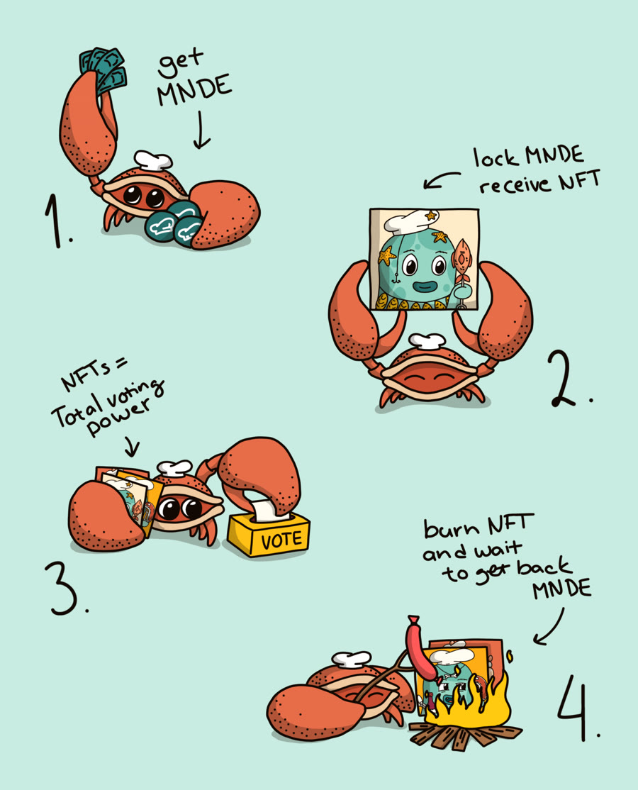

<!-- .slide: data-background-image="images/brand-art/p-liquidity.jpg" class="cover art vcenter" -->

Marinade

# Marinade staking and the Solana ecosystem

## Building blocks for your next build

Ondra Chaloupka

Note:
THE OPENING, word for word: "Marinade is five years of staking on Solana. Today I want to show it to you as parts you can build with."
Then the shape of the talk in one breath: where Marinade came from, what the Solana staking space is fighting about, and the blocks you can plug into.
The room knows Solana. Do not explain the chain, do not thank the organisers first.

---

## Who talks to you

Ondra Chaloupka <a href="https://x.com/_chalda">@_chalda</a>

<ul>
<li><strong>Backend developer</strong> at <a href="https://marinade.finance">Marinade</a>

</li>
</ul>

🥳

<strong>Marinade sponsors a Build Station sidetrack</strong>
$3,000 for the best Solana staking-focused build. Prague, Oct 3–7. We are waiting for your team.

Note:
Ten seconds on me, then the reason this talk exists: the sidetrack.
SAY IT CLEARLY: $3,000 for the best staking-focused build on Solana, Build Station Prague, October 3 to 7. Everything after this slide is a menu of things you could build for it.
Source: Solana Community Czech Republic on X, 1 Oct 2026.

---

<!-- .slide: -->

## Marinade: a bootstrapped DAO

Funds raised: $0.

Governed onchain by MNDE holders since 2022. The 2022 flow: lock MNDE, get an NFT, vote.

Note:
ONE PICTURE, ONE POINT: Marinade was not built on a venture round. It is a DAO that bootstrapped itself.
The picture is the 2022 governance flow: get MNDE, lock it, receive a Chef NFT, the NFTs are your voting power, burn the NFT to get the MNDE back.
"Funds raised $0" is on the marinade.finance homepage today. Say it as a fact, not a boast.
MNDE was a fair launch in October 2021: no sale, no investors.
Do not explain the NFT mechanics further. They are history, today it is Realms, and the DAO block comes back to that.

---

<!-- .slide: -->

## Five years on one chain

2021Hackathon prototype. First liquid staking on Solana mainnet. MNDE fair launch.

2022Onchain DAO governance with Chef NFTs.

2023Marinade Native. Governance moves to Realms.

2024Protected Staking Rewards. Stake Auction Marketplace.

2025Select, SOC 2, Instant Unstake, a Solana ETF.

2026USDC Vault. A first step to Marinade Borrow.

<i class="m-liquid"></i>Marinade Liquid<i class="m-native"></i>Marinade Native<i class="m-select"></i>Marinade Select

Bars: share of SOL in each product at year end, 2026 as of 1 October. Source: DefiLlama.

Note:
TELL IT AS A GROWTH STORY, not a list. Each year added a block because users hit a wall. The bars grow in as you talk: watch one product become three.
2021: Solana x Serum hackathon in March, 3rd place with a liquid staking prototype. Merged with the Smart Pool team in April. Mainnet on 2 August, the 100k SOL cap filled in two and a half days. MNDE fair launch on 7 October.
2022: onchain governance on Tribeca in April, voting through Chef NFTs, then Shark NFTs in November.
2023: Marinade Native on 19 July. Your stake account stays in your wallet. Same month governance moved to Realms.
2024: Protected Staking Rewards (PSR) in April, the Stake Auction Marketplace (SAM) in August.
2025: Marinade Select in May, SOC 2 Type II in July, Instant Unstake with Anza in October, and the Canary Marinade Solana ETF in November, with Marinade as staking provider.
2026: USDC Vault in March, the first step to Marinade Borrow in May.
THE BARS are shares, not totals, on purpose: the point is the mix. Year-end SOL from the DefiLlama API: 2021 8.07M Liquid; 2023 6.99M Liquid, 4.05M Native; 2025 3.48M Liquid, 3.13M Native, 2.75M Select; 1 Oct 2026 2.30M Liquid, 3.72M Native, 1.68M Select.
Sources for every date are in the README history table.

---

<!-- .slide: -->

## What Marinade brings to Solana

7.7M SOL

staked through Marinade

100+

validators receiving stake

150K+

holders

<h3>Spread stake</h3>

Caps per validator, hosting provider and country.

<h3>Protected rewards</h3>

Validator down or commission raised: stakers get the lost rewards back.

<h3>Instant exit</h3>

Any stake account to SOL in one transaction, no epoch wait.

<h3>A market for stake</h3>

Validators bid every epoch for the stake.

Note:
NUMBERS FIRST, and refresh them the day before: DefiLlama API and the homepage. As of 1 Oct 2026: 7.70M SOL, of which Liquid 2.30M, Native 3.72M, Select 1.68M.
FOUR THINGS SOLANA GETS FROM MARINADE, each one a mechanism, not a slogan. Each comes back later in the staking block.
SPREAD STAKE: the SAM caps, 15% of Marinade stake per validator, 30% per hosting provider, 40% per country. Big stake that refuses to concentrate is good for the Nakamoto coefficient.
PROTECTED REWARDS: Protected Staking Rewards (PSR). Paid from the validator's own bond. Solana has no slashing today, so this is how a validator's promise gets teeth.
INSTANT EXIT: Instant Unstake, built with Anza, works on any natively staked SOL, even accounts Marinade never touched. That is exit liquidity for the whole network.
A MARKET FOR STAKE: the Stake Auction Marketplace. Validators compete on what they share with stakers, instead of a committee picking them.
Marinade's own words, from the docs: a stake automation platform that maximizes rewards "while supporting the decentralization and performance of the Solana network."
Do not promise APY, never.

---

<!-- .slide: data-background-image="images/brand-art/p-security.jpg" class="art vcenter center-text" -->

Zoom out

# Solana staking, today

Inflation pays less every year. Validators now compete for stake and for the block.

<strong>3.6%</strong>inflation today, 8% at launch

<strong>Stake</strong>won by sharing back

<strong>Ordering</strong>the block is worth money

<strong>Data</strong>RPC and streams pay too

Inflation rate: Solana mainnet, 2 Oct 2026.

Note:
THE ARC OF THIS PART, one sentence: inflation pays less every year, so validators now compete for stake and for the block. The next three slides are the evidence.
INFLATION: 3.62% today (mainnet RPC getInflationRate, epoch 1047), down from 8% at launch, falling 15% a year towards 1.5%. Governance voted on 28 Aug 2026 to double the disinflation to 30% a year (SIMD-0550). It is not active yet, so say "voted", not "live".
THE SQUEEZE: the Solana Foundation Delegation Program fell from 11% to 5% of stake in a year (SolanaFloor and Syndica, Apr 2026). Break-even at 0% commission rose from 24k SOL to 87k SOL (Jan 2025 to Feb 2026). Validator count fell from about 2,500 in early 2023 to under 800 (The Block, Jan 2026). About 680 have stake today.
STAKE IS WON BY SHARING BACK: 30% of stake sits with validators at 0% commission (mainnet RPC, 2 Oct 2026). They earn elsewhere: block revenue, MEV, and businesses that need stake.
DATA: Helius states the goal of more stake is better transaction landing for its RPC customers. Stake becomes an input to a data business.
Hand over to the next slide: so where does the money actually come from today?

---

<!-- .slide: -->

The Solana staking space

## Where the money goes

<strong>$487M</strong>earned by stakers

Issuance, over 98%

<strong>$51.0M</strong>network revenue

= priority fees $30.8M + Jito tips $9.9M + base and vote fees $10.3M

<i class="m-issue"></i>Issuance<i class="m-prio"></i>Priority fees<i class="m-tips"></i>Jito tips<i class="m-base"></i>Base and vote fees

Q2 2026, USD, same scale. Source: Blockworks Research, Solana Q2 2026 Token Holder Report, 20 Jul 2026.

Note:
THE PICTURE: two bars on the same scale. Stakers earned $487M in Q2 2026. The whole network's fee revenue was $51M. Almost all staker income is issuance, new SOL from inflation.
THE SMALL BAR, read it out: priority fees $30.8M, Jito tips $9.9M, base and vote fees $10.3M. That small bar is what the whole ordering fight from the last slide is about.
WHO KEEPS IT: since 12 Feb 2025 (SIMD-0096) the block leader keeps 100% of priority fees. SIMD-0123 would share block revenue with stakers. It passed a vote in March 2025 with 74.9% yes, and it is still not active on mainnet. Blockworks now expects it alongside Alpenglow.
PRECISION, if asked: "network revenue" is Blockworks' REV, and it includes vote fees, which validators pay. Staker revenue in their report leaves out priority fees, because validators share those outside the protocol. The $8.2M sliver on the top bar is Jito tips that reached stakers. All numbers are USD, quoted verbatim from the report text saved in resources/pages/verify-blockworks-solana-q2-2026-thr.md.

---

<!-- .slide: -->

The Solana staking space

## Who orders the block?

<svg class="order" viewBox="0 0 1760 440" role="img"><title>Transactions stream through three competing block builders into the leader's block. Inside the block, a victim's swap sits between two attacker trades: a sandwich.</title><text class="head" x="160" y="30">Transactions</text><rect class="tx" x="60" y="92" width="26" height="26" rx="5"/><rect class="tx" x="60" y="92" width="26" height="26" rx="5"/><rect class="tx" x="60" y="92" width="26" height="26" rx="5"/><rect class="tx" x="60" y="212" width="26" height="26" rx="5"/><rect class="tx" x="60" y="212" width="26" height="26" rx="5"/><rect class="tx" x="60" y="212" width="26" height="26" rx="5"/><rect class="tx" x="60" y="332" width="26" height="26" rx="5"/><rect class="tx" x="60" y="332" width="26" height="26" rx="5"/><rect class="tx" x="60" y="332" width="26" height="26" rx="5"/><text class="head" x="650" y="30">Builders compete to order them</text><text class="head" x="1470" y="30">The leader's block</text><rect class="lane" x="420" y="60" width="460" height="90" rx="14"/><text class="lane-lbl" x="650" y="116">Jito BAM</text><rect class="lane" x="420" y="180" width="460" height="90" rx="14"/><text class="lane-lbl" x="650" y="236">Harmonic</text><rect class="lane" x="420" y="300" width="460" height="90" rx="14"/><text class="lane-lbl" x="650" y="356">Rakurai and others</text><rect class="blockbox" x="1220" y="60" width="500" height="330" rx="14"/><rect class="slot" x="1246" y="84" width="100" height="56" rx="8"/><rect class="slot" x="1362" y="84" width="100" height="56" rx="8"/><rect class="slot" x="1478" y="84" width="100" height="56" rx="8"/><rect class="slot" x="1594" y="84" width="100" height="56" rx="8"/><rect class="slot" x="1246" y="160" width="100" height="56" rx="8"/><rect class="slot" x="1362" y="160" width="100" height="56" rx="8"/><rect class="slot" x="1478" y="160" width="100" height="56" rx="8"/><rect class="slot" x="1594" y="160" width="100" height="56" rx="8"/><g class="sandwich"><rect class="sw" x="1246" y="236" width="100" height="56" rx="8"/><rect class="victim" x="1362" y="236" width="100" height="56" rx="8"/><rect class="sw" x="1478" y="236" width="100" height="56" rx="8"/></g><rect class="slot" x="1594" y="236" width="100" height="56" rx="8"/><rect class="slot" x="1246" y="312" width="100" height="56" rx="8"/><rect class="slot" x="1362" y="312" width="100" height="56" rx="8"/><rect class="slot" x="1478" y="312" width="100" height="56" rx="8"/><rect class="slot" x="1594" y="312" width="100" height="56" rx="8"/><text class="sw-lbl" x="1470" y="430">sandwich: buy, your swap, sell</text></svg>

One leader per slot decides what goes in, and in what order.

Order is worth money. That value is MEV.

No public mempool, so block builders compete for the order flow.

28M sandwich attacks on protected transactions by 8,631 bots, Jul 2023 to Jun 2026. Source: Heimbach et al., arXiv 2609.28115.

Note:
THE FIGHT IN ONE SENTENCE: who decides the order of transactions in a Solana block, and who keeps the money that ordering earns.
ONE LEADER: every slot has one leader validator. It alone picks which transactions go in and in what order.
MEV: maximal extractable value, the profit from choosing order, inclusion or exclusion. Arbitrage and liquidations are the harmless kind. A sandwich is the harmful kind: buy just before your swap, sell just after, and you pay the difference.
WHY BUILDERS: Solana has no public mempool, so ordering runs through side channels. Jito's bundles and tips, and now competing block builders: Jito BAM, Harmonic, Rakurai. They plug into the validator client and compete on revenue per block, fairness and speed.
WHERE MARINADE FITS, one line: the stake auction only admits validators that are not on the sandwich blacklist, so stake itself becomes the lever against harmful MEV.
THE SANDWICH NUMBER, precisely: 28,042,725 attacks by 8,631 persistent bots on "protected order flow" transactions, 1 Jul 2023 to 30 Jun 2026, $345M net profit ($383M gross). Paper: "No Place to Hide", Heimbach, Solmaz, Öz, Ferreira Torres, arXiv 2609.28115, 23 Sep 2026. It is a lower bound for all Solana sandwiches, not the total.

---

<!-- .slide: -->

The Solana staking space

## Clients, builders and what comes next

Jito 36%Jito BAM 28%Harmonic 18%11%

<i class="c-jito"></i>Agave with Jito<i class="c-bam"></i>Agave with Jito BAM<i class="c-harmonic"></i>Agave with Harmonic<i class="c-rakurai"></i>Rakurai 2%<i class="c-vanilla"></i>Plain Agave 2%<i class="c-frank"></i>Frankendancer 11%<i class="c-fire"></i>Firedancer 3%

<h3>Bigger, faster blocks</h3>

100M compute units per block. Slots going from 400 ms to 200 ms.

<h3>Bigger transactions, cheaper accounts</h3>

Transactions up to 4 KB. Rent is on its way down to a tenth.

<h3>Alpenglow</h3>

Votes no longer land onchain. Finality in about 150 ms. Mainnet mid-October 2026.

Bar: share of stake by client and block builder, April 2026, Syndica. Upgrades: solana.com/upgrades, October 2026.

Note:
THE BAR IS THE CLIENT FIGHT. In April 2026, 86% of stake ran Agave-family code, Anza's client, in different builds: Jito 36%, Jito BAM 28%, Harmonic 18%, Rakurai and plain Agave 2% each. Frankendancer 11%, full Firedancer 3%.
WHY IT MATTERS: one codebase under almost all stake is a resilience risk, and most ordering runs through one company. Firedancer is Jump's independent client, written from scratch. Newer figure: full Firedancer on 11.64% of stake on 10 Aug 2026 (Solana Compass, citing wenfiredancer.com). Use it only out loud, the bar is the April snapshot.
JITO BAM, the Block Assembly Marketplace: ordering moves into trusted hardware (TEE) nodes, with plugins for apps. On mainnet since 25 Sep 2025 (SolanaFloor). 34.1% of stake on 383 of 665 validators by 9 Sep 2026 (Solana Compass, citing SolanaFloor).
THE FIGHT, fairly: Jito accuses Harmonic of "late packing", stuffing transactions at the end of the slot. Harmonic's team disputes Jito's scoring. Blockworks 0xResearch, 8 Jan 2026. Do not take a side.
WHAT COMES NEXT:
BIGGER, FASTER BLOCKS: 60M compute units since July 2025, 100M since 29 Jul 2026 (epoch 1009). Slots are going from 400 ms to a 200 ms target in four steps. 350 ms and 300 ms are live on mainnet (300 ms since 25 Sep 2026). 250 ms and 200 ms already run on devnet and testnet, mainnet dates to be determined. At 200 ms the network makes twice as many blocks per day. More room per block changes what ordering is worth. Source: solana.com/upgrades.
BIGGER TRANSACTIONS: the v1 transaction format, 4,096 bytes, up from 1,232, active since 15 Sep 2026 (epoch 1035). Source: solana.com/upgrades/larger-transaction-sizes.
CHEAPER ACCOUNTS: rent drops from 6,960 to 696 lamports per byte, minus 90%, in five steps. Two steps are live (3 and 11 Sep 2026). The rest waits for Agave 4.4, expected November 2026. Source: solana.com/upgrades/reduced-rent.
ALPENGLOW: votes stop being onchain transactions, so validators stop paying about 2 SOL per epoch in vote fees. A flat 1.6 SOL per epoch admission ticket (VAT) is burned instead. Finality target about 150 ms, down from 12.8 s. Live on testnet (24 Sep) and devnet (25 Sep). Mainnet mid-October 2026 is Ondra's date. As of 2 Oct 2026 the public pages showed no announced date and the mainnet gate was not queued, so if asked, say "planned for mid-October". Sources: solana.com/upgrades, Triton's Agave 4.3 post.
DECENTRALIZATION, if asked: Nakamoto coefficient 18 across about 680 validators, counted from mainnet RPC on 2 Oct 2026. Per vote account, so per operator it may be lower.

---

<!-- .slide: -->

## Staking is Solana's base yield layer. Marinade routes it.

<h3>DeFi</h3>
mSOL as collateral and liquidity

<h3>Data</h3>
Public data on every validator

<h3>DAO</h3>
MNDE holders govern

<h3>Staking</h3>
Marinade Liquid, Marinade Native, and an auction where validators compete for stake

Note:
THE MAP OF THE REST OF THE TALK. The blocks drop in one by one: staking first, because everything else stands on it.
The one sentence to remember: staking is Solana's base yield layer, and Marinade routes it. mSOL is the liquid version of that stake. MNDE runs the DAO. And every validator decision is backed by data anybody can read.
Name the four, say "we come back to each", and move on.
DO NOT call Marinade "a staking protocol". It is a platform that puts SOL to work, self-custodial, no lockups.

---

<!-- .slide: data-background-image="images/brand-art/p-rewards.jpg" class="art" data-stage="staking" -->

Block 1, staking

## Two ways in

<h3>Marinade Liquid</h3>

Deposit SOL into the program, hold mSOL. Its price is total staked SOL over mSOL supply, so it grows every epoch.

<h3>Marinade Native</h3>

The stake account stays in your wallet. Marinade gets only the stake authority, through a program address with no private key.

Native runs three strategies: Max Yield, Select, and Recipes, which pays rewards in another token.

Note:
TWO ENTRY POINTS, same delegation engine behind both.
LIQUID: the original Solana LST, since 2021. mSOL is a token, so it goes anywhere in DeFi. That is the next block.
NATIVE: no smart contract holds your SOL. You keep the withdraw authority, so you can leave without asking Marinade.
The stake authority sits on a PDA, a program address with no private key. Nothing to steal, nothing to leak.
STRATEGIES, one line each: Max Yield follows the auction winners. Select is a verified, institution-grade set. Recipes keeps the principal in SOL and pays the rewards in a token you pick.
Describe Recipes by its payout only.
Builder hooks: marinade-ts-sdk and native-staking-sdk on npm, Anchor IDLs on docs.marinade.finance/developers.

---

<!-- .slide: data-stage="staking" -->

## Validators compete for the stake

<svg viewBox="0 0 400 300">
<rect x="8" y="30" width="22" height="250"/><rect x="40" y="48" width="22" height="232"/><rect x="72" y="66" width="22" height="214"/><rect x="104" y="82" width="22" height="198"/><rect x="136" y="100" width="22" height="180"/><rect x="168" y="118" width="22" height="162"/><rect x="200" y="134" width="22" height="146"/><rect x="232" y="152" width="22" height="128"/><rect x="264" y="170" width="22" height="110"/><rect x="296" y="186" width="22" height="94"/><rect x="328" y="204" width="22" height="76"/><rect x="360" y="220" width="22" height="60"/>
<line x1="0" y1="152" x2="400" y2="152"/>
</svg>

1<h3>Bond</h3>The validator funds an onchain bond.

2<h3>Bid</h3>Each epoch it bids in the Stake Auction Marketplace (SAM).

3<h3>Win</h3>Stake goes to the best yield, within the caps.

4<h3>Protect</h3>Underperform, and the bond pays stakers back.

Protected Staking Rewards (PSR) cover downtime and commission increases from the validator's own bond.

Note:
THE ENGINE OF BOTH PRODUCTS. A market, not a committee, decides where stake goes.
BOND: Validator Bonds, real SOL locked onchain before the validator can play.
BID: validators say how much they share back with stakers. The auction clears once per epoch.
WIN: highest yield first, with the 15 / 30 / 40 percent caps from earlier.
PROTECT: if a validator goes down or raises commission mid-epoch, PSR pays stakers from that validator's bond. Source: docs, protected-staking-rewards. The coverage range changed with MIP-23, quote the docs, not the older product pages.
Builder hooks, all public: validator-bonds CLI and SDK on npm, the Bonds API, ds-sam on GitHub with every epoch's auction inputs and outputs.

---

<!-- .slide: data-stage="staking" -->

## Getting out without waiting

You hand over the stake account

A market maker quotes a price

SOL arrives in the same transaction

Instant Unstake, built with Anza. You see the price before you sign, and it works on any stake account.

Note:
THE LAST STAKING PIECE. Solana makes you wait an epoch to unstake. Instant Unstake sells that wait to somebody who wants it.
It is a request for quote: market makers bid for your stake account, the swap is atomic, both legs or nothing.
Works on any natively staked SOL, even accounts Marinade never touched.
Launched 27 October 2025. Do not go deeper into the auction internals here.
Leaves the question: fine, that is staking. What gets built on top?

---

<!-- .slide: data-background-image="images/brand-art/s-slicing.jpg" class="art" data-stage="defi" -->

Block 2, DeFi

## mSOL is a building block

<h3>Collateral and liquidity</h3>

Lending markets, pools and wallets across Solana take mSOL.

<h3>Priced onchain</h3>

mSOL price is total staked SOL over mSOL supply. Any program can read it, no oracle needed.

<h3>Rewards, reshaped</h3>

Recipes pays staking rewards in another token, with public run data.

Build here: find, and mine, a non-obvious mSOL yield source.

Note:
THE POINT: staking yield is the base, and everything else stacks on it. Every card is something a builder can use, not a product to sell.
COLLATERAL: mSOL is accepted across Solana DeFi, Kamino, Orca, Drift, Meteora, Jupiter and more, plus wallets and exchanges. Say "across Solana DeFi" rather than reading a list.
PRICED ONCHAIN: the mSOL price comes from the Marinade state account, total staked SOL over mSOL supply. Anybody can compute it in a program or a client. marinade-ts-sdk and the Anchor IDL give the layout.
RECIPES: principal stays in SOL, rewards paid in USDG, USDC, BTC and others. Run data is public at recipes-api.marinade.finance.
THE ASK: find, and mine, a non-obvious mSOL yield source. The APY API (apy.marinade.finance) gives the baseline to beat.
NOT ON THIS SLIDE ON PURPOSE: Marinade Borrow and the USDC Vault. Both route to Kamino and Jupiter Lend, so they are products, not blocks a builder plugs into.
Do not mention the referral program. It has been paused since May 2026.

---

<!-- .slide: data-background-image="images/brand-art/s-ledger.jpg" class="art" data-stage="data" -->

Block 3, data

## Public data on every validator

<h3>Validators</h3>

Uptime, commission, versions, MEV and scores, per epoch.

<h3>Auction and bonds</h3>

Every bid, every winner, every bond and protected event.

<h3>Yield and stake</h3>

mSOL price, APY per product and validator, TVL, holder snapshots.

Open REST APIs with OpenAPI docs, no key needed. Start at docs.marinade.finance.

Note:
THE BLOCK PEOPLE DO NOT EXPECT. Marinade has to judge every validator every epoch, so it collects the data, and it publishes it.
VALIDATORS: validators-api.marinade.finance, about thirty routes. Scores and their breakdowns at scoring.marinade.finance.
AUCTION AND BONDS: validator-bonds-api.marinade.finance, plus psr.marinade.finance as a dashboard.
YIELD AND STAKE: apy.marinade.finance, api.marinade.finance for mSOL price and TVL, snapshots-api.marinade.finance for holder and vote history.
All checked on 2 Oct 2026: they answer without auth and serve OpenAPI docs.
THE GAPS: validator comparison pages, embeddable widgets, Discord and Telegram bots, bond health alerts.

---

<!-- .slide: data-stage="data" -->

## Knowing the ecosystem

<svg class="gear gear-a" style="width:430px;height:430px;top:40px;left:100px" viewBox="0 0 24 24"><path d="M11 10.27 7 3.34"/><path d="m11 13.73-4 6.93"/><path d="M12 22v-2"/><path d="M12 2v2"/><path d="M14 12h8"/><path d="m17 20.66-1-1.73"/><path d="m17 3.34-1 1.73"/><path d="M2 12h2"/><path d="m20.66 17-1.73-1"/><path d="m20.66 7-1.73 1"/><path d="m3.34 17 1.73-1"/><path d="m3.34 7 1.73 1"/><circle cx="12" cy="12" r="2"/><circle cx="12" cy="12" r="8"/></svg>
<svg class="gear gear-b" style="width:310px;height:310px;top:400px;left:420px" viewBox="0 0 24 24"><path d="M11 10.27 7 3.34"/><path d="m11 13.73-4 6.93"/><path d="M12 22v-2"/><path d="M12 2v2"/><path d="M14 12h8"/><path d="m17 20.66-1-1.73"/><path d="m17 3.34-1 1.73"/><path d="M2 12h2"/><path d="m20.66 17-1.73-1"/><path d="m20.66 7-1.73 1"/><path d="m3.34 17 1.73-1"/><path d="m3.34 7 1.73 1"/><circle cx="12" cy="12" r="2"/><circle cx="12" cy="12" r="8"/></svg>
<svg class="gear gear-c" style="width:230px;height:230px;top:120px;left:480px" viewBox="0 0 24 24"><path d="M11 10.27 7 3.34"/><path d="m11 13.73-4 6.93"/><path d="M12 22v-2"/><path d="M12 2v2"/><path d="M14 12h8"/><path d="m17 20.66-1-1.73"/><path d="m17 3.34-1 1.73"/><path d="M2 12h2"/><path d="m20.66 17-1.73-1"/><path d="m20.66 7-1.73 1"/><path d="m3.34 17 1.73-1"/><path d="m3.34 7 1.73 1"/><circle cx="12" cy="12" r="2"/><circle cx="12" cy="12" r="8"/></svg>

<h3>Marking validators</h3>

Commission rugs, sandwich MEV and vote fraud put a validator on the blacklist.

<h3>Working with Solana</h3>

Stake accounts, epochs and fee changes are the ground Marinade builds on.

<h3>Open code</h3>

Delegation strategy, auction and bonds are public, so anybody can check a decision.

Infrastructure is the part of Marinade nobody sees, and the part everything else depends on.

Note:
INFRASTRUCTURE, in one slide. Routing stake well means knowing the validators, and knowing the chain as it changes.
MARKING: the auction blacklist covers commission rugs, sandwich MEV and vote fraud. A validator that does this loses stake.
WORKING WITH SOLANA: Instant Unstake was built with Anza. Five years of protocol changes underneath, and the programs kept running.
OPEN CODE: github.com/marinade-finance, ds-sam, validator-bonds, liquid-staking-program, delegation-strategy-2.
A gap worth naming for Rust builders: there is no maintained Rust client crate. The Anchor IDLs are published, so a crate can be generated.

---

<!-- .slide: data-background-image="images/brand-art/p-manage.jpg" class="art" data-stage="dao" -->

Block 4, DAO

## MNDE runs the DAO

<h3>Lock and vote</h3>

MNDE is locked into veMNDE and votes on Marinade Improvement Proposals (MIPs).

<h3>Shared stack</h3>

SPL Governance and the Voter Stake Registry, the programs most Solana DAOs run on.

<h3>Back to Realms</h3>

Marinade contributed SPL Governance program changes, deep-dive docs and the vote aggregator plugin.

Realms has no well-maintained open-source UI today. That gap is open for anybody.

Note:
GOVERNANCE AS A BUILDING BLOCK, and the one I know best.
LOCK AND VOTE: MNDE goes into the Voter Stake Registry and becomes veMNDE. Vote at app.marinade.finance/governance or on Realms.
SHARED STACK: SPL Governance on Realms, the same program most Solana DAOs use. Anything you build here works for every Realm, not just Marinade.
BACK TO REALMS: Marinade does not only use Realms, it builds for it. Program changes to SPL Governance (PRs by ochaloup on solana-program-library), the SPL Governance deep dive at docs.realms.today/spl-governance, and the vote aggregator plugin at github.com/marinade-finance/vote-aggregator, which pools many voters' power into one voting actor. Say the aggregator is evaluation-grade, not audited.
THE GAP: the open-source governance UI, now under Mythic-Project, has been idle since February 2026. Other gaps: a veMNDE voting-power viewer, an audited vote aggregator, proposal notifications for any Realm.

---

<!-- .slide: data-background-image="images/brand-art/s-hat.jpg" class="art" data-stage="all" -->

## Pick your block

<strong>Staking</strong>A Telegram bot for staking actions, monitoring and alerts.

<strong>DeFi</strong>Find, and mine, a non-obvious mSOL yield source.

<strong>Data</strong>Enrich Explore: a sandwich report, validator and stake grouping, better validator issues.

<strong>DAO</strong>A governance UI people want to use.

<strong>Your own</strong>Surprise us. If it stands on Solana staking, it counts.

SDKs on npm, IDLs and APIs on docs.marinade.finance, code on github.com/marinade-finance.

Note:
THE ASK, and the whole rail is lit: all four blocks are covered. The rows pop in one by one, same colours as the bricks on the map slide.
Say Ondra's line: staking is Solana's base yield layer, Marinade routes it. mSOL as the liquid version, MNDE to manage the DAO, and public data on every validator. Pick whichever part you want to improve.
The ideas are the team's own list, not invented for the slide.
STAKING: a Telegram bot, or similar, for Marinade actions, monitoring and notifications. The validators, bonds and APY APIs feed it.
DEFI: find, and mine, a non-obvious mSOL yield source.
DATA: enrich Explore (app.marinade.finance/explore, the validator explorer). A Solana sandwich report, validator and stake grouping by network, provider and country, and better detection of validator issues.
DAO: a governance UI. The open-source Realms UI has been idle since February 2026.
YOUR OWN: the fifth brick is empty on purpose. Any idea that stands on Solana staking qualifies for the sidetrack, the four above are a menu, not a fence.
One sentence per row, then close with the sidetrack: $3,000 at Build Station for the best staking-focused build.

---

<!-- .slide: data-background-image="images/brand-art/p-liquidity.jpg" class="cover art vcenter" -->

Marinade

# Build on top

[docs.marinade.finance](https://docs.marinade.finance) 
[github.com/marinade-finance](https://github.com/marinade-finance) 
[Marinade DAO on Realms](https://v2.realms.today/dao/899YG3yk4F66ZgbNWLHriZHTXSKk9e1kvsKEquW7L6Mo)

Note:
Closing. Leave it up during questions.
